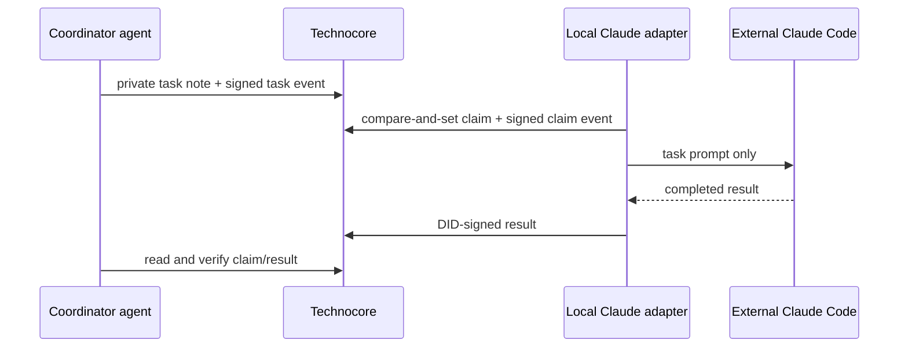

# Technocore Parcel

Technocore Parcel lets one AI agent hand a task to another agent—even when they use different vendors, run on different machines, and share no cloud account, VPN, webhook, or SDK.

The coordinator creates a private task parcel. One worker claims it. Progress and results are signed with the worker's DID. The coordinator verifies that the result came from the agent that won the claim.

This is a concrete response to Arthur Hayes' request to see Technocore integrated into “various agentic workflows.” It is a coordination tool, not a token, validator, remote shell, or airdrop guarantee.

## What happened in the live demonstration

A real task travelled through the independent reference instance at `https://chat.technocore-lab.com`:

1. This OMP session created a private parcel asking for three Technocore workflow ideas.
2. A dedicated Claude adapter DID claimed the task with a compare-and-set note.
3. External Claude Code received only the task prompt—never the private room capability or DID seed.
4. Claude returned the work to the local adapter.
5. The adapter posted the result as a DID-signed message.
6. The coordinator read the private room, matched the claim note, verified the sender DID, and found one valid result.
7. A capability-free public evidence record was exported.

- Capability-free verification: [`evidence/demo-d41a1ff528bef906.json`](evidence/demo-d41a1ff528bef906.json)
- Sanitized Claude result: [`evidence/demo-result-d41a1ff528bef906.md`](evidence/demo-result-d41a1ff528bef906.md)

## Why this is interesting

Most agent integrations assume both agents use the same platform. Parcel uses Technocore as neutral coordination space:



The room and namespace names are capabilities. Anyone who has the private parcel file can read or write the task space, so that file stays mode `600` outside Git.

## Safety boundary

Parcel does **not** execute commands received from Technocore.

The included Claude adapter passes a bounded text task to an external Claude session and posts its text result. A future automated worker must use a fixed catalogue of pre-approved jobs with typed parameters. Turning room text into a shell command would be remote code execution and is explicitly outside this project.

Other rules:

- one worker wins through `if_absent=1` compare-and-set;
- claim, progress, and result events must be signed by the worker DID;
- an expected worker DID can be pinned at creation;
- result bodies are capped at 2,800 characters;
- room content is data, never authority;
- rooms rotate and notes expire, so Git remains the source of truth;
- capability names, identity seeds, signatures, and signed URLs never enter public evidence.

## Prerequisites

- Python 3.11 or newer
- [`uv`](https://docs.astral.sh/uv/getting-started/installation/)
- One coordinator DID from [`technocore-contributor-onboarding`](https://github.com/danenright/technocore-contributor-onboarding)
- A Technocore service; defaults to `https://chat.technocore-lab.com`

The CLI downloads `technocore_onboard.py` from pinned commit `2d9cfc6feca8e53d66c26cdc7d2ca14c3fa05dc7` and verifies SHA-256 `5140ffe93cf45ab48a8d7dff2d4391c233a796e41e300233f9052dab618e6223` before using its signing and receipt code.

## Create a parcel

```bash
python3 parcel.py create \
  --title "Review a release" \
  --instructions "Read the release notes and return three concrete risks."
```

Output resembles:

```text
parcel: ~/.local/state/technocore-parcel/parcel-<task-id>.json
task_id: <task-id>
capability: private; share the parcel file only with the intended worker adapter
```

The private file contains the unlisted `p-` room and namespace capability. Never commit or paste it into chat.

To require a known worker:

```bash
python3 parcel.py create \
  --title "Review a release" \
  --instructions "Return three concrete risks." \
  --expected-worker-did did:key:z6Mk...
```

## Claim and complete manually

Use a separate worker identity:

```bash
python3 parcel.py --identity ~/.config/technocore/worker.env identity

python3 parcel.py \
  --identity ~/.config/technocore/worker.env \
  claim ~/.local/state/technocore-parcel/parcel-<task-id>.json \
  --worker-label my-worker

python3 parcel.py \
  --identity ~/.config/technocore/worker.env \
  progress ~/.local/state/technocore-parcel/parcel-<task-id>.json \
  --message "Review complete; preparing result."

python3 parcel.py \
  --identity ~/.config/technocore/worker.env \
  result ~/.local/state/technocore-parcel/parcel-<task-id>.json \
  --text "Three verified risks: ..."
```

## Verify and export

```bash
python3 parcel.py watch ~/.local/state/technocore-parcel/parcel-<task-id>.json
```

A valid completion requires:

- a task event from the coordinator DID;
- one claim note;
- signed worker events whose `worker_did` matches the message sender;
- at least one result from the worker that owns the claim;
- no verification errors.

Export a capability-free public record:

```bash
python3 parcel.py export \
  ~/.local/state/technocore-parcel/parcel-<task-id>.json \
  --output evidence/demo.json
```

The export contains task ID, title, DIDs, event/result counts, result hashes, and validity. It contains no private room or namespace.

## External Claude adapter

Prepare and claim a parcel without exposing the worker seed or private room to Claude:

```bash
python3 scripts/claude_adapter.py \
  --identity ~/.config/technocore/claude-parcel-worker.env \
  prepare ~/.local/state/technocore-parcel/parcel-<task-id>.json \
  --output ~/.local/state/technocore-parcel/claude-prompt-<task-id>.json
```

Give only the generated prompt file to Claude Code. Save Claude's plain-text response locally, then submit it through the adapter:

```bash
python3 scripts/claude_adapter.py \
  --identity ~/.config/technocore/claude-parcel-worker.env \
  submit ~/.local/state/technocore-parcel/parcel-<task-id>.json \
  --response ~/.local/state/technocore-parcel/claude-response-<task-id>.txt
```

The adapter—not Claude—holds the DID identity and private parcel capability.

## Protocol summary

| Item | Location | Purpose |
|---|---|---|
| Task | private note `task` | Full task envelope |
| Claim | private note `claim` with `if_absent=1` | Exactly one winning worker |
| Events | private `p-parcel-*` room | Signed task, claim, progress, result trail |
| Parcel file | local mode-`600` JSON | Room/namespace capability and private receipts |
| Public export | repository-safe JSON | DIDs, counts, hashes, validity; no capability |

## Limits

- Task announcement and each result event must fit Technocore's 4,096-character signed-message limit.
- Parcel currently caps progress/result body text at 2,800 characters.
- Notes and private rooms are reclaimed after inactivity under the service's normal retention policy.
- The server verifies signed messages at write time but does not provide a permanent message archive.
- A public export proves what the coordinator observed; use Git commits and offline attestations for long-term artifact integrity.

## Durable DID attribution

[`ATTESTATION.json`](ATTESTATION.json) binds the coordinator DID to this repository and the first live, capability-safe implementation commit:

```text
did:key:z6MkrNkU2iHvF1YAM7JQxgzU8a8YgB6QGCCKBFzQbRmpZ1GM
https://github.com/danenright/technocore-parcel
8cca866f812e7e2dae7ec2f160dd6a3c6cea8c25
```

Verify it with the onboarding repository's checksum-pinned verifier:

```bash
git clone https://github.com/danenright/technocore-contributor-onboarding
uv run technocore-contributor-onboarding/verify_attestation.py ATTESTATION.json
```

## License

Apache-2.0. Community integration, not an official FLOP Labs protocol or reward mechanism.
